# Peregrine: open-source VTOL FPV tail-sitter

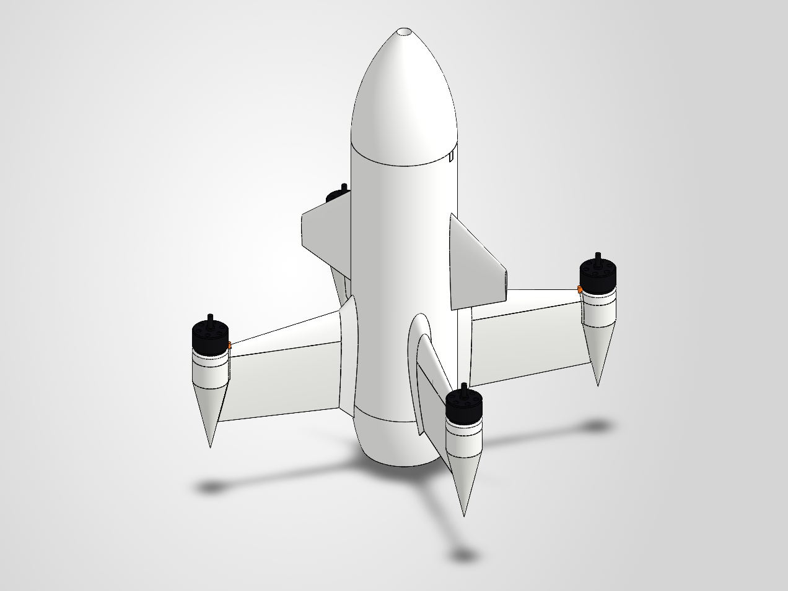

**Peregrine** (named after the peregrine falcon, the fastest animal on Earth) is a hobby **VTOL tail-sitter**. It stands on its four wing-tip spikes, takes off and hovers like a quadcopter, then pitches nose-forward and flies on its wings. It uses four motors and no control surfaces. **Design target: 200 km/h (56 m/s) in forward flight.**

The shape is inspired by the new Ukrainian interceptor drone, but this is an original design built as an **open-source FPV project**. Every part was modelled from scratch with **Claude Code (Opus 5.5)** driving the CAD (AI-to-CAD).

> **Scope:** airframe and flight electronics only. There are **no payload provisions**, and none should be added. Fly it within your local aviation rules.

## What's in the repo

| Folder / file | Contents |
|---|---|
| [`cad/step/`](cad/step) | STEP files of every part designed here, plus the full assembly without vendor parts |
| [`BOM.md`](BOM.md) | Full bill of materials with purchase links, radio and goggle recommendations |
| [`docs/WIRING.md`](docs/WIRING.md) | Every cable, connector, pad and route |
| [`software/SETUP.md`](software/SETUP.md) | Flashing ArduPilot, calibration, radio, OSD, first flights |
| [`software/ardupilot/`](software/ardupilot) | ArduPlane parameter file for the Kakute H7 (QuadPlane tail-sitter, airspeed sensor, high-speed gain scaling) |
| [`images/`](images) | Renders and CFD (airflow simulation) results |

## Key numbers

| | |
|---|---|
| Layout | Quad tail-sitter, motors at 45° / 135° / 225° / 315°, 190 mm from the axis |
| Length | about 460 mm (tail to nose) |
| Body | Ø100 mm tube, ogive nose, 2 swept canards, 4 aerofoil wings (NACA 00xx) |
| Power | 4 × 2807 1300 KV, 7″ tri-blade high-pitch props (7×5 / 7×6), 6S 2200 mAh |
| Top speed target | 200 km/h (56 m/s), with an airspeed sensor and speed-based gain scaling |
| Structure | Carbon tube spar in each wing (6 mm), carbon rod in each canard (2 mm), ASA / PA-CF prints |
| Flight controller | Holybro Kakute H7 + Tekko32 F4 50A 4-in-1 |
| Firmware | ArduPilot **ArduPlane** (`Q_TAILSIT_ENABLE = 2`, copter-motor tail-sitter) |
| Video | HDZero Freestyle V2 + Micro V2 camera (digital, MSP OSD) |
| RC | ExpressLRS 2.4 GHz |
| GPS | Holybro Micro M10 in the nose |

## Build notes

- **Split wings.** Each wing is a top part (leading-edge beam + motor nacelle) and a bottom part (panel), split along the seam line. The motor leads lie in a groove on the split face before the halves are pinned and glued, so nothing has to be threaded through a closed wing.
- **Tabbed root.** The wings slide into slots in the body's aerofoil root fairings.
- **Carbon reinforcement for 200 km/h.** A 6 mm carbon tube is glued into a channel in each wing panel (45 % chord, 100 mm long), and a 2 mm carbon rod goes into each canard from inside the body.
- **Wiring.** All wiring is modelled and colour-coded in the CAD: orange = motors, red = battery, yellow = VTX power/UART, black = video coax, blue = MIPI, cyan = GPS, green = receiver.

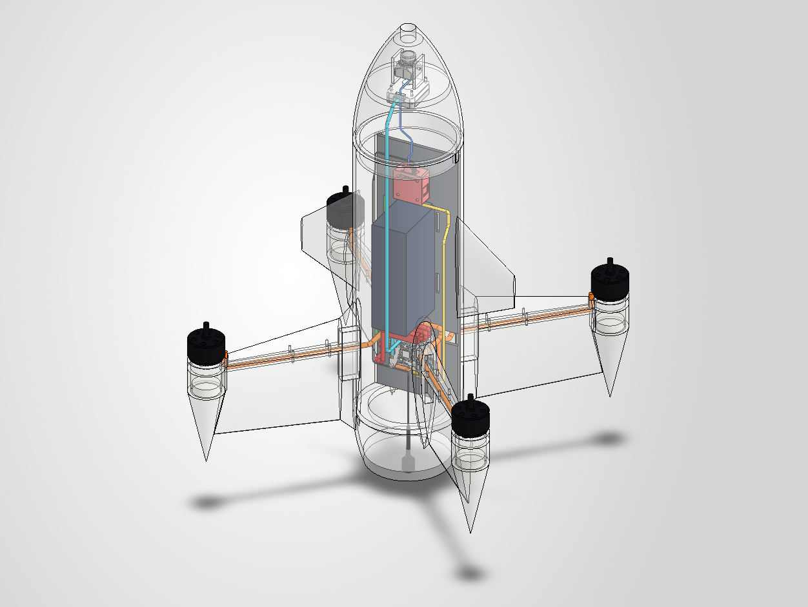
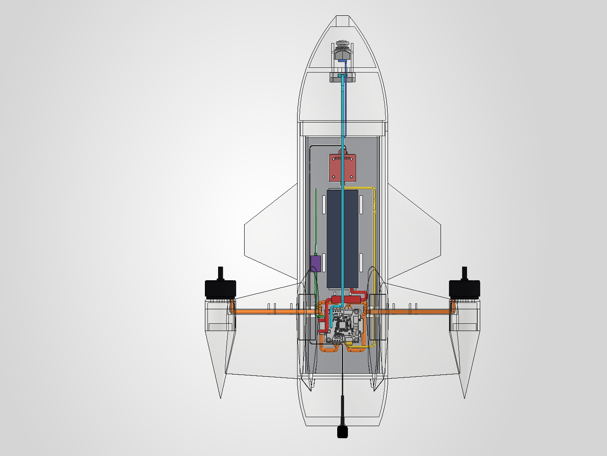

| Front | Top (hover attitude) |
|---|---|
| 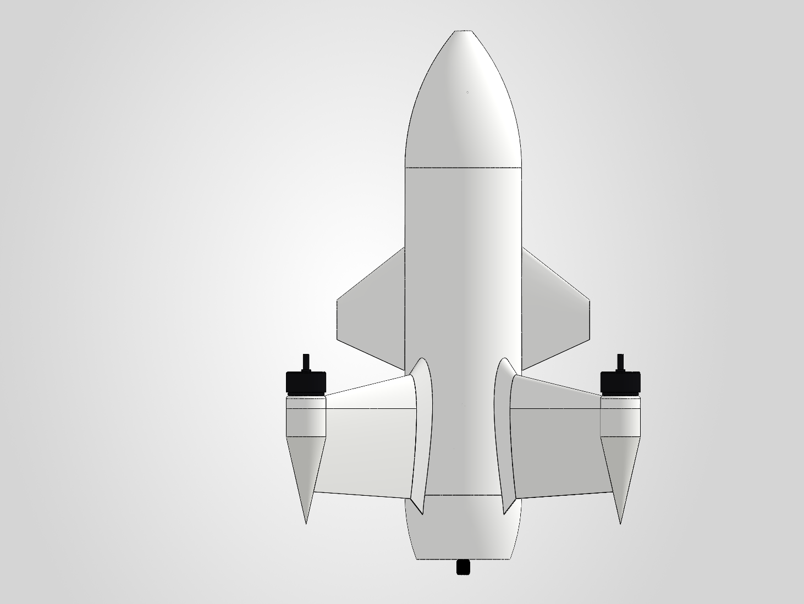 | 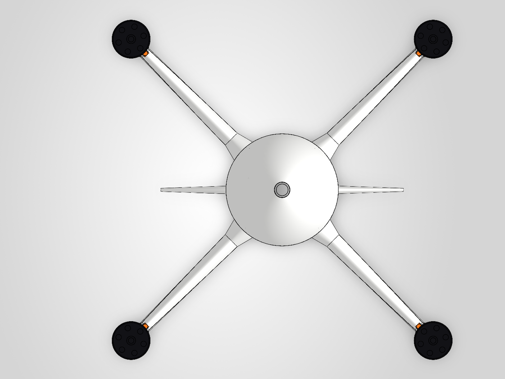 |

## CFD (airflow simulation)

External-flow CFD on the outer shape only (internal parts removed), air, nose-first forward flight.

### At the 200 km/h target (56 m/s)

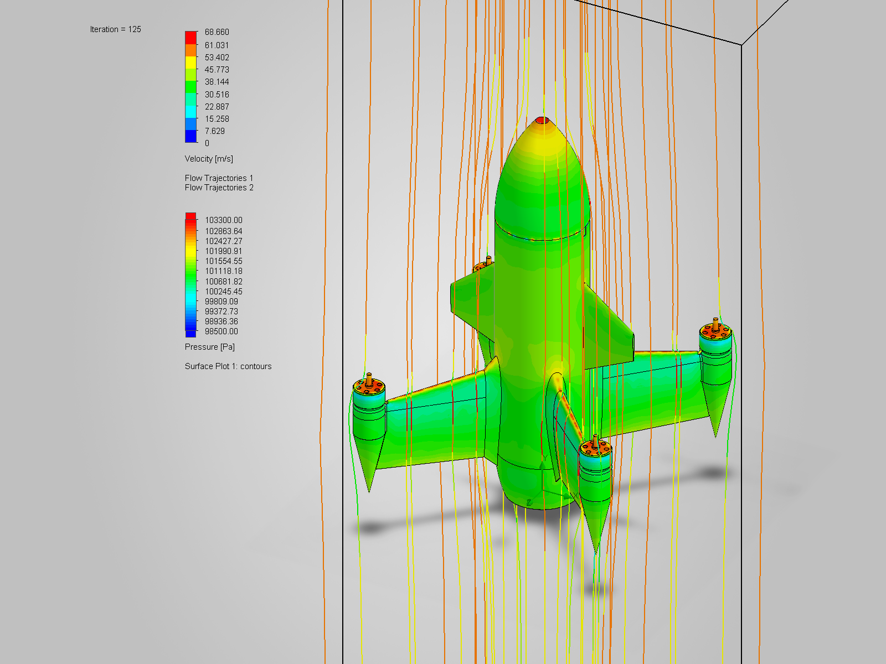

| Result | Value |
|---|---|
| Drag at 200 km/h | **9.9 N** (about 1 kgf), converged |
| Drag area (CD·A) | about 0.0053 m² |
| Thrust power needed | about 550 W, roughly 40 A from a 6S pack with the props at 60 % efficiency |

Streamlines are coloured by velocity and the skin by pressure. Red marks stagnation at the nose tip, the wing leading edges and the motor bells; blue marks suction around the nacelles.

| Front | Isometric |
|---|---|
| 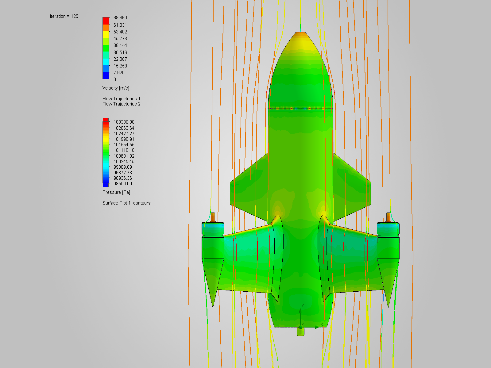 | 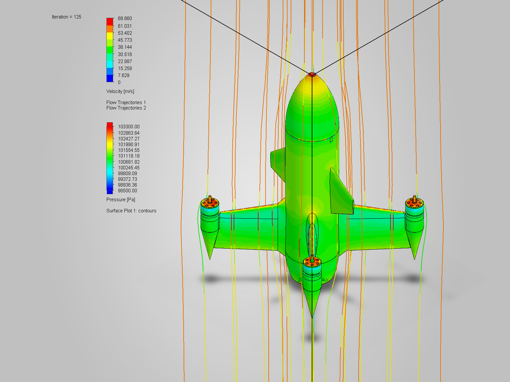 |

### Shape study at 300 m/s (hypothetical)

> ⚠️ 300 m/s (Mach 0.87) is **not an achievable speed** for this airframe; it only shows where the shape builds shocks and wake. Colours *inside* the body tube are not meaningful (air enters through the camera opening in the model).

| Mach number | Velocity | Pressure |
|---|---|---|
| 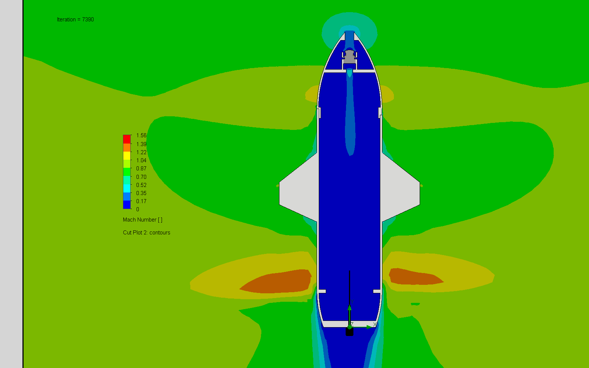 | 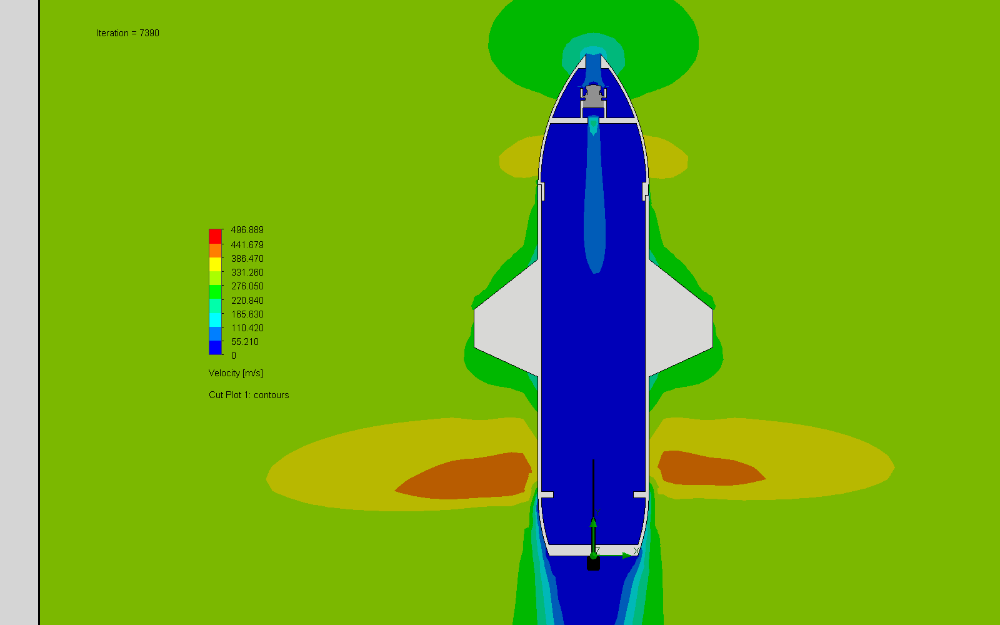 | 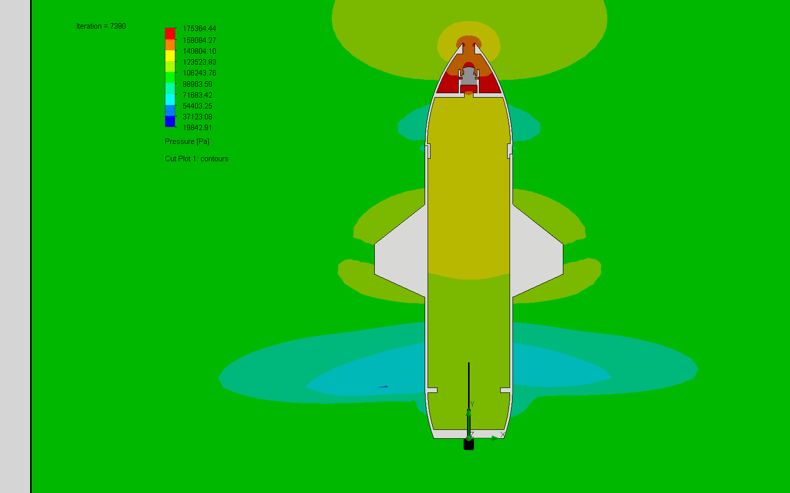 |

## Vendor CAD (not included)

The assembly uses vendor models that are **not redistributed** here: HDZero CAD is CC BY-NC, and Holybro's terms are unknown. Download them yourself if you want the complete assembly:

- Holybro Kakute H7 / Tekko32 stack and Micro M10 GPS: [holybro.com](https://holybro.com) (product pages → downloads)
- HDZero Freestyle V2 VTX, antenna and Micro V2 camera: [docs.hd-zero.com](https://docs.hd-zero.com/freestyle-v2)

The assembly STEP in `cad/step/` already leaves them out.

## Status

- ✅ CAD complete, interference-checked, all wiring connected
- ✅ ArduPilot parameters written (names checked against the ArduPilot docs, **not yet flight-tested**)
- ⏳ First build and hover test
- ✅ CFD at the 200 km/h target: drag 9.9 N
- ⏳ Mass properties + measured all-up weight (sets `Q_TAILSIT_DSKLD`)

## Licence

- Hardware (CAD, drawings, images, docs): **CC BY-SA 4.0**
- Software / configuration (parameter files): **GPL-3.0**, matching ArduPilot

See [`LICENSE`](LICENSE).
